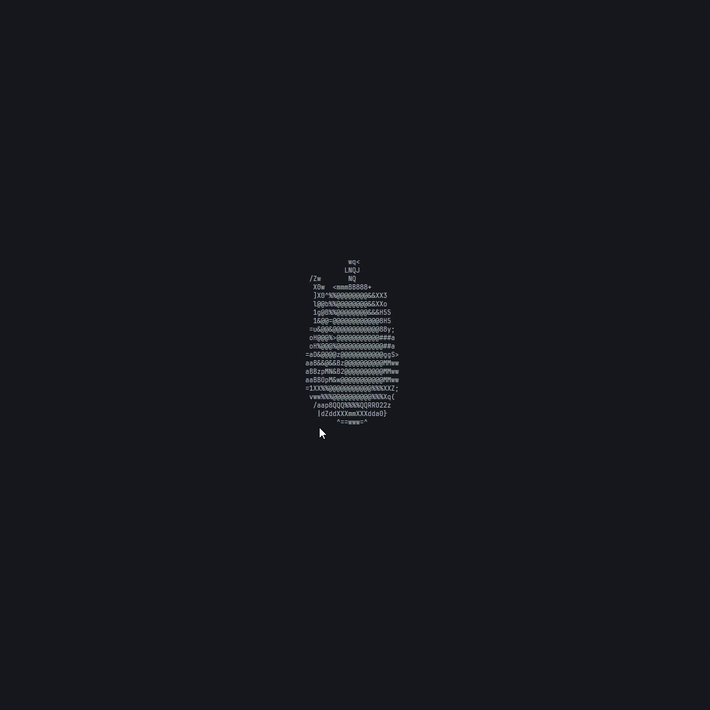

# rview the terminal 3D rasterizer 🎨🖥️

A simple Rust software rasterizer that renders 3D models like cubes or .obj files as ASCII art right in your terminal. It covers:

- 3D transformations (scale, rotate, translate)
- Perspective projection
- Triangle rasterization
- Basic lighting for shading 🌞

### How to use

1. Load or create a 3D object  
2. Run the program
3. **Drag the mouse** to rotate the camera 🔄
4. **Scroll wheel** to zoom in/out 🔍
5. Press **C** to quit ✌️

### What’s inside?

- Matrix math with **glam**
- Triangle rasterization with ASCII shading
- Lighting based on face normals and a light source that follows the camera

### Earlier demo

### Sources

- Utah teapot : [https://sketchfab.com/3d-models/utah-teapot-92f31e2028244c4b8ef6cbc07738aee5](https://sketchfab.com/3d-models/utah-teapot-92f31e2028244c4b8ef6cbc07738aee5)
- Suzanne : Blender
